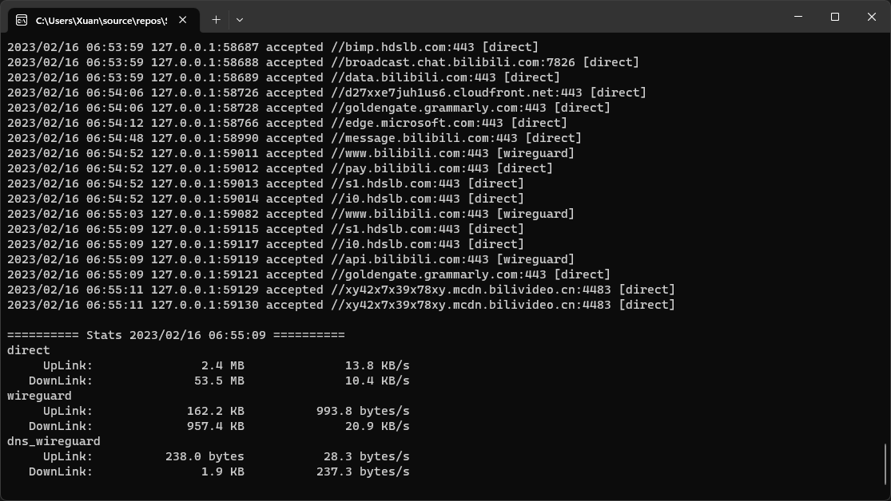

# SimpleV2Ray

A simple client in terminal hosting V2Ray ([v2ray-core](https://github.com/v2fly/v2ray-core)) on Windows.

## Features

- Auto system proxy (HTTP) setup based on V2Ray configuration.
- Outbound stats monitoring.

## Quick Start

1. Put `v2ray.exe` and `v2ctl.exe` into folder `v2ray-core`.
2. Edit V2Ray configuration in file `config.json`.
   - Make sure one inbound that accepts `http` protocol is configured.
   - Make sure all of the outbounds have tags so that they can be shown in the stats.
   - Make sure `StatsService` is enabled in the api config and both `statsOutboundUplink` and `statsOutboundDownlink` is enabled in the policy config.
   - Make sure the inbound and routing for api (outbound) is valid.
3. Run `SimpleV2Ray.exe`.
